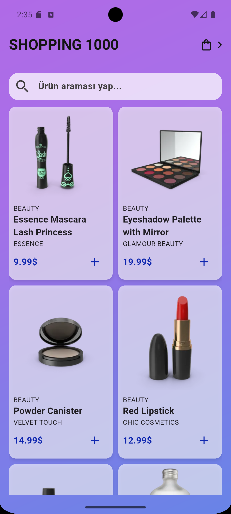
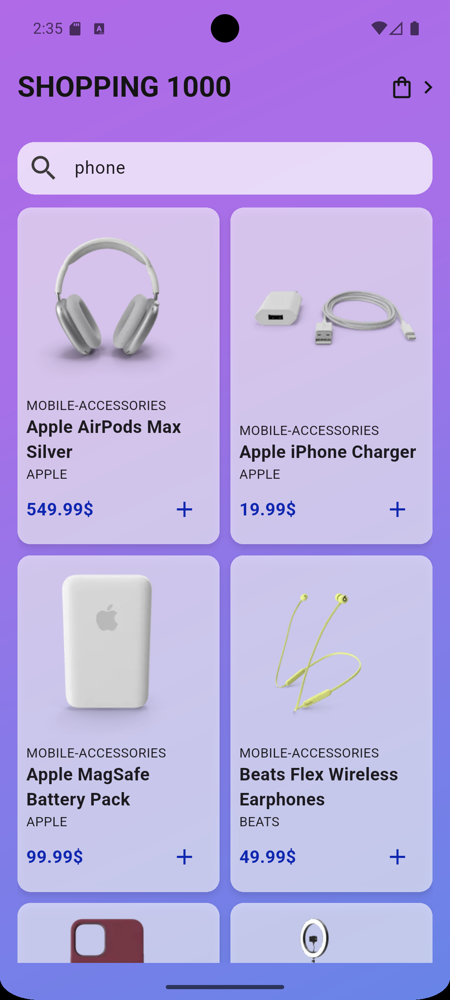
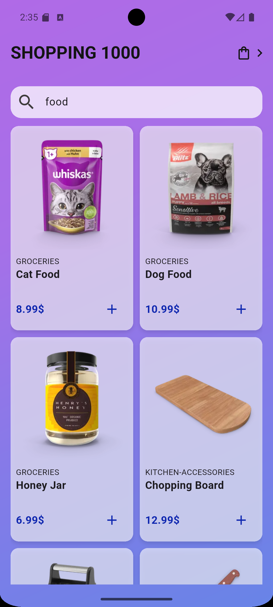
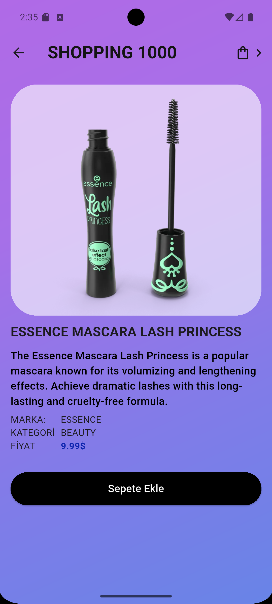
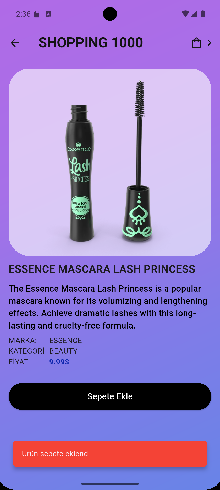
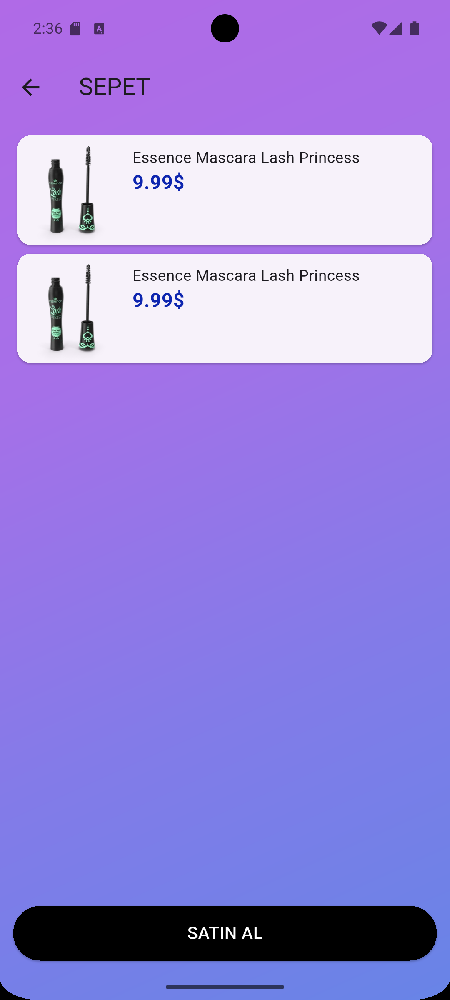
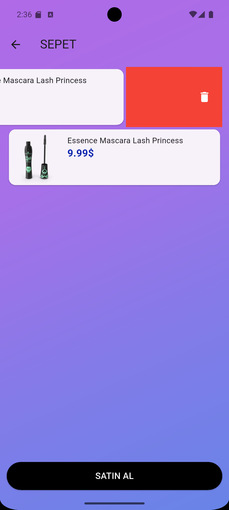

# SOFTWARE PERSONA 12. DÖNEM YAZILIM STAJI FLUTTER PROJESİ

## Hazırlayan: Murat ASLAN

  

### **GENEL PROJE TANITIMI**

    Bu projede basit bir alışveriş uygulaması hedeflenmiştir.Proje içerisinde
    ürünlerin gridview yapısında bulunduğu anasayfa, ürünlerin tekil olarak
    bulunduğu bir ürün ayrıntı sayfası ve sepet bilgisinin bulunduğu bir sepet
    ayrıntı sayfası bulunmaktadır.

  

### **UYGULAMA HAKKINDA YAZILIMSAL VE DONANIMSAL ÖZELLİKLER**

Flutter -   3.41.3 
Dart    -   3.11.1 
 
**PAKETLER**   -   **SÜRÜM**  
Http   -   ^1.6.0 
Provider   -   ^6.1.5+1 | 
    
Kullanılan cihaz özellikleri 
1080x2400 pixel, android 16, api 36, x86_64

  

### **UYGULAMA ÇALIŞMA MANTIĞI**

    Uygulama çalışması sırasında bizi ilk olarak bir appbar bir arama kutusu ve
    ürünlerin bulunduğu bir gridview yapısı karşılamaktadır. Arama kutusu ile
    ürünlerde arama işlemi gerçekleştirebilir ve anlık olarak sayfadaki gridview
    yapısında sonucu görebiliriz. Gridview yapısındaki herhangi bir ürünün kutusuna
    tıklayarak ürünlerimizin ayrıntı sayfasına gidebilir veya kutu içerisindeki "+"
    iconu ile ürünlerimiz sepete ekleyebiliriz.
        
    Ürün ayrıntı sayfası bize ürünler hakkında daha fazla ayrıntı ve ürüme ait bir
    büyük görsel imkanı sağlamaktadır yine bu sayfa ile istersek appbar üzerinde ana
    sayfaya geri dönüş veya sayfanın altında bulunan "sepete ekle" butonu ile ilgili
    ürünü sepete ekleyebiliriz.

    Son olarak bütün sayfaların appbar kısmının sağında bulunan sepet iconu ile sepet
    bilgi sayfasına ulaşabilir ve sepetteki ürünlerimiz hakkında genel bilgi ve istersek
    sepetten çıkartma işlemi gerçekleştirebiliriz. Bir ürünü sepetten çıkartmak için
    ilgili ürünün bulunduğu kutucuğu sağdan sola çekmemiz yeterlidir. Son olarak
    sayfanın en aşağısında bulunan "sipariş ver" butonu ile sepetteki ürünlerin
    siparişini verip sepeti boşaltırız.

  

### **UYGULAMA İLE İLGİLİ EKRAN GÖRÜNTÜLERİ**

  
  
  
   
  
   
  
  
   
  
  

